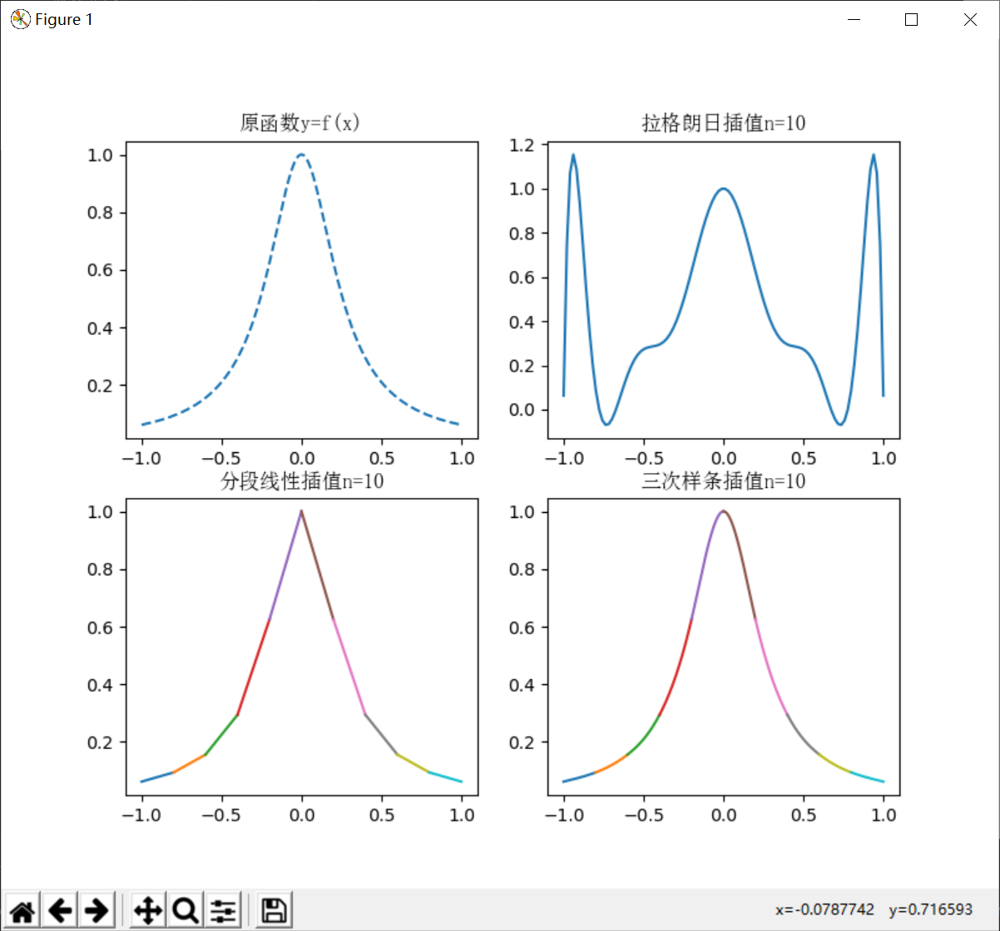

# Interpolation
 拉格朗日插值、分段线性插值、三次样条插值

## 问题描述
对函数  
$$f(x)=\frac{1}{1+15x^2}$$  
构造插值函数，插值区间为$[-1,1]$，给定节点为$x_j = -1+jh, h = \frac{2}{n}, j=0,1,...n$。  
n=10,分别利用lagrange插值，分段线性插值，三次样条插值给出相应的函数曲线和数据表，并分析误差及成因。

## 求解效果
